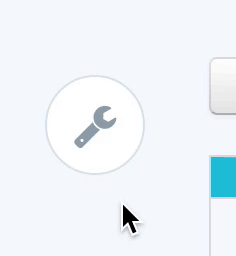

# sp-spinny-menu - spinny tool menu
*_Developed by the folks at [SignalPath](http://www.signalpath.com)_*



## Installation

1. This is an AngularJS directive, so first make sure that [Angular](https://angularjs.org/) is installed.
1. `bower install sp-spinny-menu`
1. Add to your index.html:

    ```
    <link rel="stylesheet" href="bower_components/font-awesome/css/font-awesome.css">
    <link rel="stylesheet" href="bower_components/sp-spinny-menu/dist/css/sp-spinny.css">

    <script src="bower_components/angular-fontawesome/dist/angular-fontawesome.js"></script>
    <script src="bower_components/sp-spinny-menu/dist/js/sp-spinny.js"></script>
    ```

1. Add the __signalpath.spinny__ module to your module dependencies:

    ```
    angular.module('myModule', ['signalpath.spinny']);
    ```

1. Add tool button definitions to your controller:

    ```
    // see possible icon names at http://fontawesome.io/icons/
    vm.tools = [{icon: 'filter', action: doMyAction}];

    function doMyAction() {
        console.log('It works!');
    }
    ```

1. Add the directive to your view:

    ```
    <div sp-spinny-menu="myCtrl.tools"></div>
    ```

###Additional Options
To add multiple levels of buttons, add buttons to the __children__ property:

    vm.tools = [
        {icon: 'filter', action: doMyAction},
        {icon: 'eye', children: [
            {icon: 'list'},
            {icon: 'calendar'},
            {icon: 'th-large', children: [
                {icon: 'list', disabled: true} // set disabled to true to disable button
            ]}
        ]}
    ];

## Todos
* Add support for other icon libraries
* Allow for more than 5 sub-buttons in a level